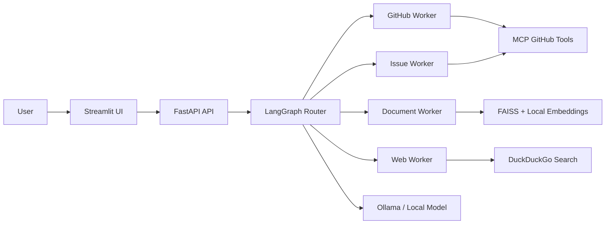

# MCP-Powered AI Project & Community Assistant

A local-first developer assistant that routes requests to specialized agents for GitHub repository analysis, document question answering, web research, and issue creation.

The project combines **Model Context Protocol (MCP)**, **LangGraph**, **FastAPI**, **Streamlit**, **FAISS**, and **Ollama** to demonstrate privacy-conscious agent orchestration and tool use without requiring a paid LLM API.

## Project status

**Functional prototype.** The repository includes the backend API, Streamlit interface, MCP-based GitHub tooling, local document retrieval, agent routing, Docker deployment, and a basic automated health test.

## Problem

Generic language models are often disconnected from current repositories and private project documentation. Sending internal files to hosted model providers can also create privacy and cost concerns.

This project addresses that gap by:

- retrieving current repository information through explicit GitHub tools;
- answering questions over uploaded documents using local embeddings and FAISS;
- routing requests through a transparent LangGraph workflow;
- running model inference locally through Ollama;
- exposing the system through a FastAPI backend and Streamlit interface.

## Capabilities

| Capability | Implementation |
| --- | --- |
| Request routing | LangGraph router selects the appropriate worker |
| GitHub analysis | MCP tools and GitHub REST API integration |
| Local document QA | PDF/text ingestion, embeddings, and FAISS retrieval |
| Web research | DuckDuckGo search through LangChain community tools |
| Issue workflows | GitHub issue-oriented agent node |
| Streaming responses | Server-Sent Events endpoint |
| Local inference | Ollama-compatible chat and embedding models |
| Deployment | Docker Compose with backend, frontend, and Ollama services |

## Architecture



## Repository structure

```text
.
├── app/
│   ├── agents/          # LangGraph router and specialized worker nodes
│   ├── api/             # FastAPI routes for chat, GitHub, and file workflows
│   ├── services/        # GitHub, embeddings, retrieval, and model services
│   └── main.py          # FastAPI application and streaming endpoints
├── frontend/            # Streamlit user interface
├── tests/               # Automated tests
├── backend.Dockerfile
├── frontend.Dockerfile
├── docker-compose.yml
└── pyproject.toml
```

## Quick start with Docker

### Prerequisites

- Docker and Docker Compose
- A GitHub personal access token for authenticated GitHub requests
- Sufficient local resources to run an Ollama model

### 1. Configure the environment

Create a `.env` file in the repository root:

```env
GITHUB_TOKEN=your_github_token
```

Do not commit real tokens.

### 2. Start the stack

```bash
docker compose up --build
```

### 3. Open the services

- Streamlit UI: `http://localhost:8501`
- FastAPI: `http://localhost:8000`
- API documentation: `http://localhost:8000/docs`
- Ollama: `http://localhost:11434`

The Docker Compose configuration mounts the host Ollama model directory into the Ollama container.

## API endpoints

| Method | Endpoint | Purpose |
| --- | --- | --- |
| `GET` | `/health` | Backend health check |
| `POST` | `/api/chat` | Synchronous agent response |
| `POST` | `/api/chat_stream` | Streaming response over Server-Sent Events |

Additional GitHub and file routes are registered from `app/api/`.

## Development

The project requires Python 3.13 or later.

Using `uv`:

```bash
uv sync
uv run uvicorn app.main:app --reload
```

Run the test suite:

```bash
uv run pytest
```

## Design decisions

### Explicit tool boundaries

GitHub operations are exposed as tools rather than being simulated by the model. This separates reasoning from external actions and makes the workflow easier to inspect.

### Local document retrieval

Uploaded files are embedded locally and indexed with FAISS. The model receives retrieved context instead of the full document collection.

### Deterministic routing

The LangGraph router maps requests to specialized workers, reducing the tendency of one general-purpose prompt to handle every workflow poorly.

### Privacy-conscious inference

Ollama allows the core inference path to run locally. External calls are limited to the services explicitly requested by a workflow, such as GitHub or web search.

## Limitations

- This is a prototype rather than a production authorization system.
- GitHub permissions depend on the token supplied by the operator.
- Local model quality and latency depend on the selected model and hardware.
- Web search is external and should not be treated as a private workflow.
- Uploaded-document security, multi-user isolation, and persistent access control require additional hardening.

## Skills demonstrated

- Python backend engineering
- FastAPI and streaming APIs
- Model Context Protocol integration
- LangGraph agent orchestration
- GitHub API tooling
- Retrieval-augmented generation
- FAISS vector search
- Docker Compose deployment
- Local open-weight model inference
- Automated testing and reproducible setup documentation

## Author

**Vipul Ponugoti**  
B.Tech CSE (Artificial Intelligence and Machine Learning)  
[GitHub](https://github.com/vipul674) · [LinkedIn](https://www.linkedin.com/in/vipul-ponugoti-3a731928b/)

## License

See [LICENSE](LICENSE).